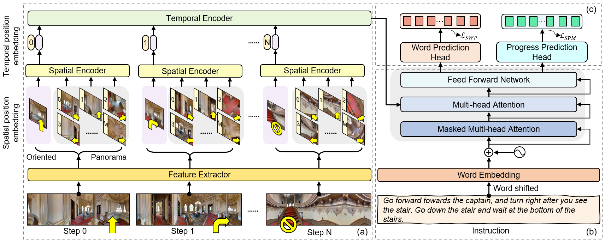

# PASTS: Progress-aware Spatio-Temporal Transformer Speaker For Vision-and-Language Navigation

This repository is the official implementation of PASTS.

Vision-and-language navigation (VLN) is a crucial but challenging cross-modal navigation task. One powerful technique to enhance the generalization performance in VLN is the use of an independent speaker model to provide pseudo instructions for data augmentation. However, current speaker models based on Long-Short Term Memory (LSTM) lack the ability to attend to features relevant at different locations and time steps. To address this, we propose a novel progress-aware spatio-temporal transformer speaker (PASTS) model that uses the transformer as the core of the network. PASTS uses a spatio-temporal encoder to fuse panoramic representations and encode intermediate connections through steps. Besides, to avoid the misalignment problem that could result in incorrect supervision, a speaker progress monitor (SPM) is proposed to enable the model to estimate the progress of instruction generation and facilitate more fine-grained caption results. Additionally, a multifeature dropout (MFD) strategy is introduced to alleviate overfitting. The proposed PASTS is flexible to be combined with existing VLN models. The experimental results demonstrate that PASTS outperforms all existing speaker models and successfully improves the performance of previous VLN models, achieving state-of-the-art performance on the standard Room-to-Room (R2R) dataset.




## 1. Requirements and Installation
1. Please install MatterPort3D simulator from [here](https://github.com/peteanderson80/Matterport3DSimulator).
2. Install requirements:
```setup
pip install -r requirements.txt
```
3. Download annotations, features, and pretrained models of R2R from [Here](https://www.dropbox.com/scl/fo/uu5npnqbffmvnstzn7v7n/h?dl=0&rlkey=on8tu0ii310zozf2simze9xt7) and put them into `datasets/`

4. Download pretrained lxmert (Optional, if you want to pre-train the DUET based on LXMERT)
```
mkdir -p datasets/pretrained 
wget https://nlp.cs.unc.edu/data/model_LXRT.pth -P datasets/pretrained
```

5. Install coco-caption tool to validate the speaker from [here](https://github.com/tylin/coco-caption).

## 2. Train the speaker
Use the following command to train the speaker:
``` train speaker
cd map_nav_src
bash scripts/train_r2r_speaker.sh
```
Four kinds of features can be chosen: `resnet`,  `vitbase`, `clip640`, and `clip768`.

## 3. Validate the speaker
Use the following command to validate the speaker:
``` valid speaker
cd map_nav_src
bash scripts/validate_r2r_speaker.sh
```
By default, this only computes the BLEU score for the speaker. After correctly installing coco-caption, you can use the following command to compute more metrices:
``` validate speaker with coco-caption
cd map_nav_src
bash scripts/validate_r2r_speaker.sh --compute_coco
```

## 4. Train the follower
Use following command to train the follower:
``` train follower
# pre-train (Optional, you can directly use our sharing pre-trained model)
cd pretrain_src
bash run_r2r.sh

# fine-tune
cd map_nav_src
bash scripts/train_r2r.sh
```
Note that the path of the pre-trained follower and the trained speaker should be update.

## 5. Validate the follower:
Use following command to validate the follower:
``` validate follower
cd map_nav_src
bash scripts/validate_r2r.sh
```

# Acknowledge
This code is built based on the following repositeries. We thank to the authors for their awesome work and sharing:
- [DUET](https://github.com/cshizhe/VLN-DUET)
- [EnvDrop](https://github.com/airsplay/R2R-EnvDrop)